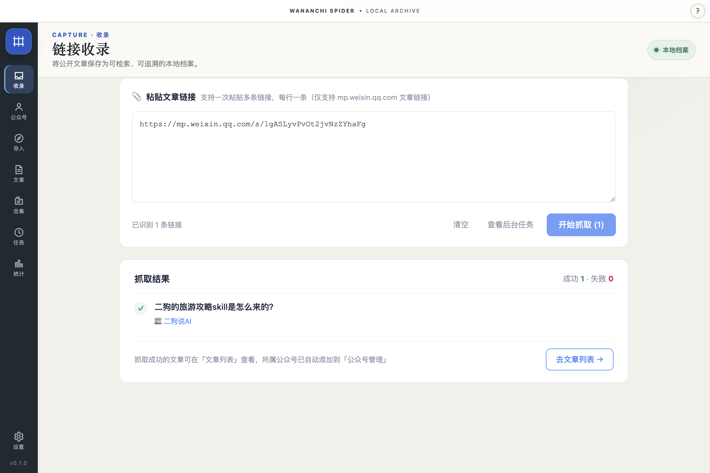
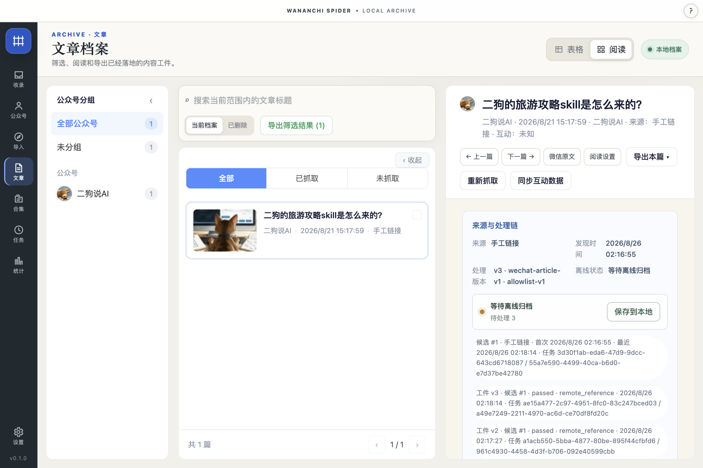
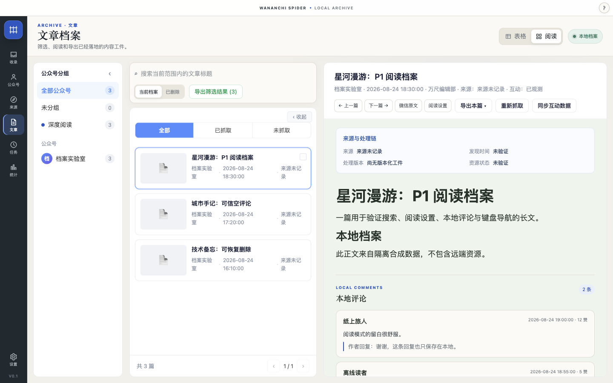
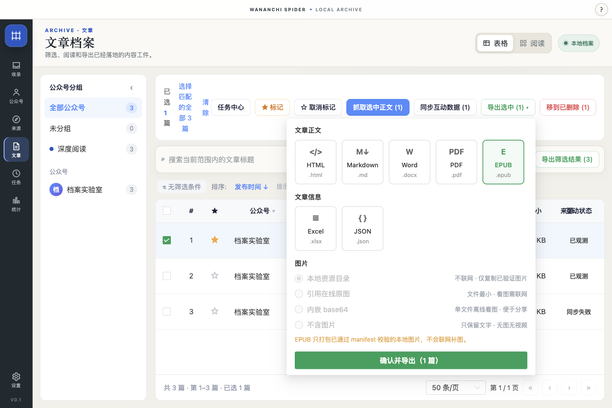
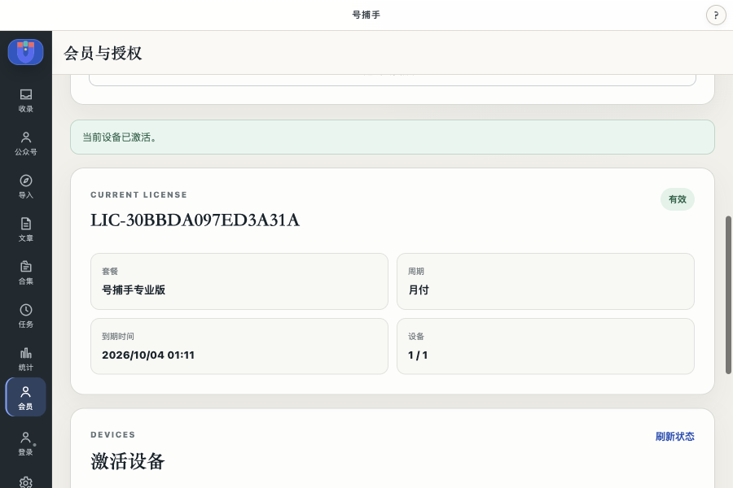

# 号捕手

### 把微信公众号公开文章，变成你的本地资料库

收录值得留下的内容，在自己的电脑上查找、阅读，再导出到下一份工作里。

[了解套餐与获取方式](#套餐与获取方式) · [查看真实记录](./docs/proof.md) · [提交建议](https://github.com/hanfeizi5237gmail/haobushou/issues/new?template=feature-request.yml)

一条公开文章链接的收录记录：成功 1，失败 0。截图展示该次操作结果，证据范围见 [说明](./docs/proof.md#真实链接收录)。

## 让有用的文章有处可找

做研究时留下的行业文章、运营时参考的选题、写作时准备再读的材料，常常散在聊天记录和收藏里。需要用的时候，还得重新找链接、核对来源、整理文件。

号捕手是一款微信公众号公开文章整理桌面工具。把文章收录后，可以按公众号筛选、搜索标题，打开已经归档到本地的内容阅读。需要整理成研究资料或写作素材时，再导出为文件继续使用。

长期关注一个领域，也可以逐步积累自己的文章档案，回看不同公众号的选题和表达。文章库默认保存在本机，备份和导出由自己掌握。

## 从一条链接开始整理

### 收录文章，接着完成同步

在「链接收录」粘贴一条可访问的 `mp.weixin.qq.com` 公开文章链接。收录后，到文章档案查看标题、公众号和来源；使用已验证来源同步历史内容时，可以在任务中心查看进度。

任务支持暂停、恢复、取消和失败重试，重启后也能接续保存的进度。哪些已经处理、哪些失败、哪些还在等待，都有对应状态，便于继续整理。

### 找到资料，打开阅读

在文章档案中按公众号筛选，或用标题关键词找到内容。档案保留来源与处理记录，核对引用、回看竞品文章时，可以知道材料来自哪里、处理到了哪一步。

这张截图展示了已建立的文章档案；其资源状态仍是「等待离线归档」，待处理 3。查看资源状态并完成本地归档后，再使用对应内容离线阅读。

阅读器用于回看已经保存在本机的内容。上图是界面示例，其中的文章和评论不代表真实用户内容或评价；离线可读范围取决于正文与资源的本地归档结果。

### 导出后，继续自己的工作

准备写作时，可以把正文导出为 Markdown 或 Word（DOCX）接着整理；需要留存阅读文件时，可选 HTML 或 PDF。文章信息还可以导出为 Excel、JSON，供后续统计和资料管理使用。

单篇文章可以直接导出，会员还可在套餐权益范围内批量导出选中或筛选出的文章，并备份完整数据库。

图中还出现 EPUB 选项；目前公开证据未包含其独立导出验收，本页的当前能力说明仅列 HTML、Markdown、Word、PDF、Excel 和 JSON。图片是否能离线打开，取决于资源是否已归档及所选导出方式。

## 一次同步任务的记录

2026-09-02 的一次 WeRead 历史同步记录中，发现了 98 个列表候选，去重后 94 篇进入正文队列。其中 54 篇产生本地归档工件，1 篇正文处理失败；用户暂停任务时，另有 39 篇保留为待处理。

这些数字对应不同处理阶段，可用来判断接下来要继续同步还是重试失败项。它们是一次低频试点的快照，不代表普遍成功率、速度或容量；产生归档工件也不等于所有图片资源都已完成离线保存。详见 [任务证据](./docs/proof.md#真实任务快照)。

## 接下来会完善什么

号捕手会继续围绕个人资料库完善同步稳定性、异常恢复和导出体验，让检索与资料整理更顺手。更多内容来源会分别验证，再按验证结果扩展覆盖范围；Windows 的真实安装与发布验证也在路线图中。

随着个人资料库逐步沉淀，号捕手也会探索团队协作、成员与席位管理、内容共享和更完整的知识工作流，让文章归档进一步连接研究、运营与内容生产。这些属于长期探索，不是当前套餐权益，也没有确定交付日期。

## 套餐与获取方式

免费版保留本地阅读和单篇基础导出。需要集中整理多篇文章、备份完整资料库时，可以选择会员月方案（30 天）或年方案（360 天）。

| 能力 | 免费版 | 会员版（专业版） |
| --- | --- | --- |
| 登录、反馈与本地文章阅读 | 支持 | 支持 |
| 单篇基础导出 | 支持 | 支持 |
| 多篇或筛选批量导出 | 每次最多 1 篇 | 按套餐权益上限 |
| 完整数据库备份 | 不包含 | 包含 |
| 会员设备激活 | 不包含 | 按授权设备上限 |
| 支持方式 | 社区支持 | 标准支持 |

### 联系与开通

想了解号捕手、获取安装包或开通会员，可以直接 [在闲鱼联系我](https://m.tb.cn/h.8LRMVA7?tk=lMxVTgwIWSL)，也可以用微信扫描下方二维码添加好友。联系时告诉我你的电脑系统和想整理的内容，方便确认适合的版本与套餐。

会员按所选套餐开通 30 天或 360 天，到期后按需续期，不自动扣款、不自动续费。

会员登录采用邮箱验证码。授权界面可查看套餐、授权编号、到期日期和设备状态。上图为隔离测试授权，线上登录及开通请以服务页面的开放状态为准。授权到期或被撤销后恢复免费权益；退款对权益的影响以实际授权状态为准。

### 获取并开始使用

1. 通过 [闲鱼](https://m.tb.cn/h.8LRMVA7?tk=lMxVTgwIWSL) (#联系与开通) 联系我，确认电脑系统、安装包和套餐。
2. 安装后，用一条自己有权访问的公开文章链接开始收录，查看档案和资源状态。
3. 完成本地归档后阅读、筛选和导出。需要批量导出或完整备份时，通过上面的联系方式开通会员。

平台记录基于本仓库的 0.1.0 证据快照：macOS Apple Silicon 已有本地运行的候选制品，正式签名与公证状态须在安装前确认；Windows 已生成交叉构建候选，真实 Windows 安装、运行、签名与 SmartScreen 验证尚未完成。下载页只应展示完成真实制品验证的平台；本页不把候选构建当成正式 Windows 下载，也不承诺 Intel Mac 兼容。

## 常见问题

**需要拥有自己的公众号吗？**

公开文章链接收录不要求拥有目标公众号。部分来源需要在本机完成登录或人工验证，请按界面提示操作，可访问范围以来源返回为准。

**能整理一个公众号的全部历史文章吗？**

请先用目标来源和时间范围核对实际结果。历史覆盖可能受群发范围、验证码、频控、页面变化及网络状态影响。WeRead 当前是非官方的低频试点来源，不能据此承诺任意公众号全量收录。遇到失败或暂停，可查看任务状态后继续或重试。

**断网后还能阅读吗？**

已经归档到本地的正文和资源可以离线读取。只有链接、资源待处理或导出时引用在线图片的内容，仍可能需要联网；请先检查归档状态。

**文章会上传到号捕手的服务器吗？**

文章正文、任务、SQLite、备份和导出数据保存在桌面端，不上传会员后台。会员服务处理账号、订单、授权、设备和反馈；获取来源内容及登录授权需要相应网络请求。本地优先不等于软件完全不联网。

**到期了怎么办？会自动续费吗？**

不会自动扣款或续费。到期后恢复免费权益，需要批量导出等会员能力时再按需购买。重装或换机时，先核对原账号和授权设备状态，再咨询恢复流程；设备数量与恢复规则以该授权为准。

**怎么反馈问题？**

可以提交 [问题反馈](https://github.com/hanfeizi5237gmail/haobushou/issues/new?template=bug-report.yml) 或 [功能建议](https://github.com/hanfeizi5237gmail/haobushou/issues/new?template=feature-request.yml)，说明系统、版本、操作步骤和希望完成的工作。截图与诊断附件上传前，请去除 Token、Cookie、手机号、本地路径、文章正文等敏感信息。GitHub Issue 是公开页面，不要提交账号验证材料。

## 使用边界

仅处理公开页面或已获授权访问的内容，保存、转载及后续使用需遵守版权、个人信息保护和来源平台规则。号捕手不提供绕过验证码、绕过访问限制或防封服务，也不承诺无限抓取或 100% 成功。当前没有文章正文云上传、在线阅读、云端文章检索或远程控制采集服务。

需要介绍号捕手，可使用 [图文与视频素材包](./marketing/README.md)。产品事实、截图来源和验证范围统一记录在 [证据说明](./docs/proof.md) 中。
